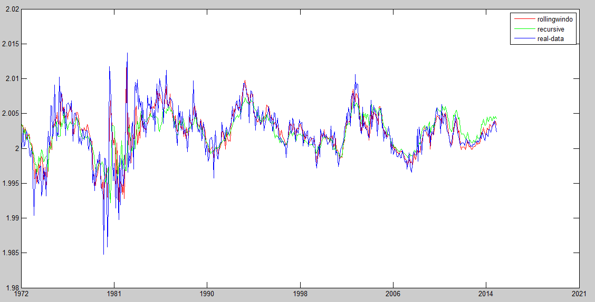
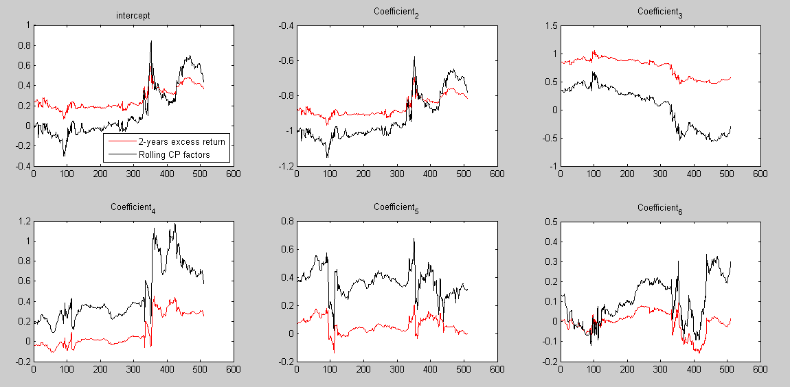

[](http://quantlet.de/index.php?p=info)

## [](http://quantlet.de/) **Adaptive Penalized MacroFactor** [](http://quantlet.de/d3/ia)

```yaml

Name of Quantlet : Adaptive Penalized MacroFactor

Published in : 'Unpublished - Theoretical description of why we are going to use the adaptive
methods'

Description : 'Builds a classification model to predict by combining the shrinking methods with the
adaptive methods. model can automatically detect the homogenous interval and the active
macro-factor set'

Keywords : regression, forcast, simulation, financial, price, likelihood

Author [New] : Xinjue Li

Submitted : Tue, February 2 2016 by Xinjue Li

Example : There are two examples, one is about coefficients varying, the other is forecasting

```






```matlab

```
